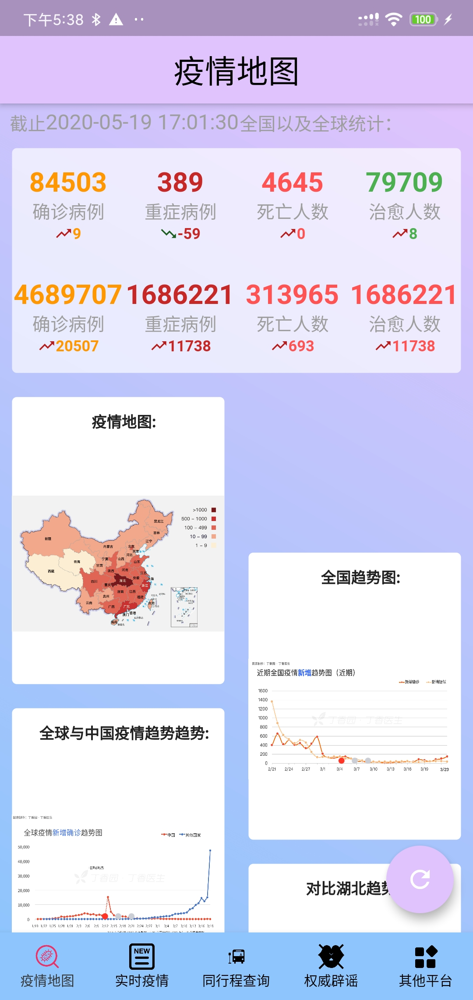
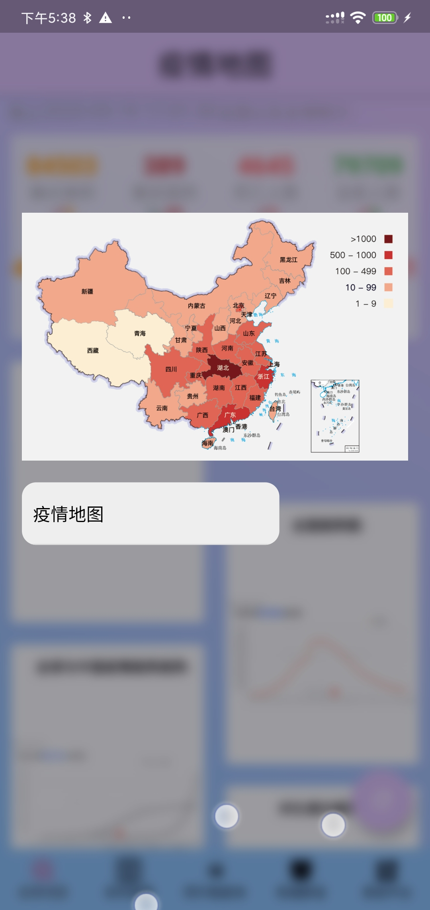
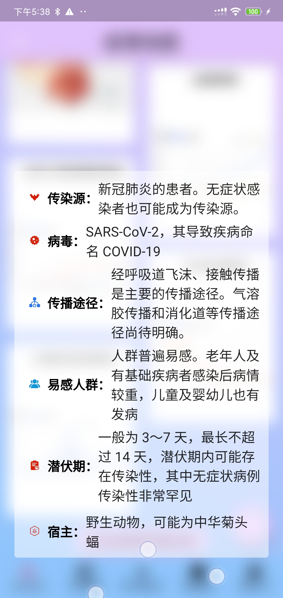
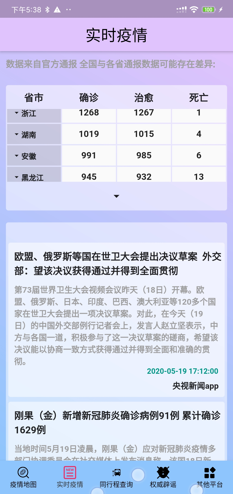
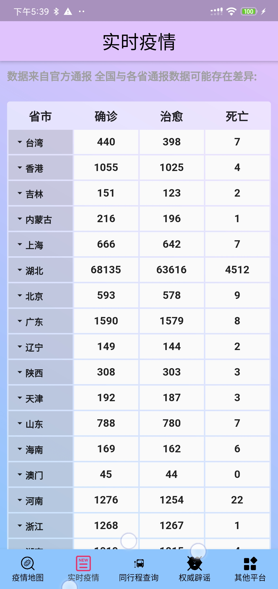

# 1. 修改

借这个项目继续flutter 的学习

|  |  |  |
| --------------------------------------------------- | --------------------------------------------------- | --------------------------------------------------- |
|  |  |  |
|  |  |                                                     |
|                                                     |                                                     |                                                     |

# 2. 原项目2019-nCoV （战疫情）

 
本项目使用flutter开发,主要内容为疫情地图、实时疫情、同行程查询、辟谣、以及收集平台疫情通道，以达到实时掌握最新疫情，完成紧急辟谣,同行程车次查询等目的。

## 2.1. 欢迎Star..... 交流学习。

## 2.2. 总体图：

### 2.2.1. 界面图

​    

## 2.3. 数据来源

1. 天行数据
2. BlankerL大佬：https://github.com/BlankerL/DXY-2019-nCoV-Crawler
3. programmerauthor大佬：https://github.com/programmerauthor/spread-information
4. 新浪、腾讯、丁香园等大厂

#### 2.3.1. 对以上表示感谢！

## 2.4. 主要使用插件：

1. dio: 1.0.13
2. flutter_easyrefresh: ^1.0.1
3. webview_flutter: ^0.3.19+5
4. bot_toast: ^2.0.0+2
5. lpinyin: ^1.0.8
6. flutter_swiper: ^1.1.6
7. splashscreen: ^1.2.0
8. flutter_localizations:

## 2.5. 最后
本人实际上是做Java后端的，所以ui界面可能不是很好看，请见谅，再者这个项目我也是一边开发一边学习，之前没搞过flutter，可能命名，语法什么的不太标准，后期熟了，再改正。。另一方面，由于数据都是第三方的，基本上都是东拼西凑来的，本来想自己爬一套的，想了想有现成的，就没有造轮子。如果有什么问题，欢迎提出，能力范围内，会快速解决。

